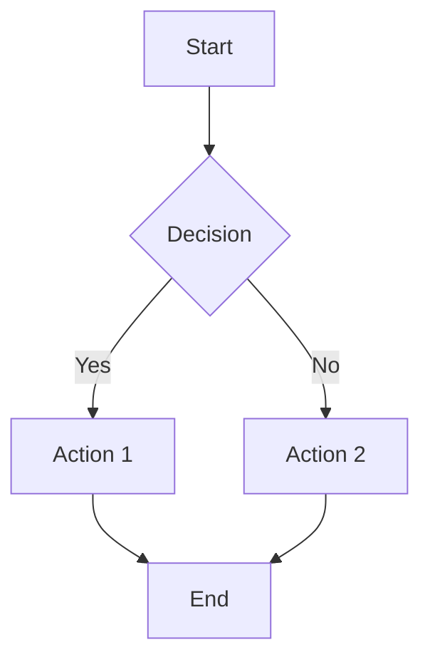
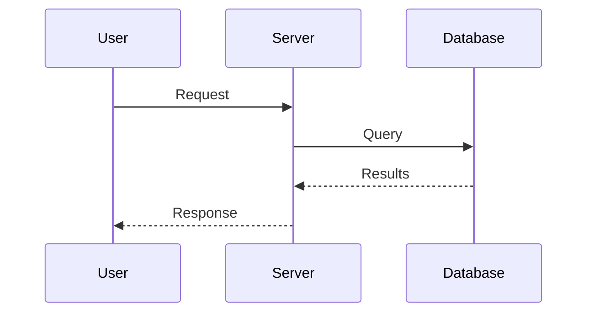

# Diagram Maker

Create clear, helpful diagrams to visualize concepts.

## Diagram Types

### Flowcharts (Mermaid)


### Sequence Diagrams


### ASCII for Quick Sketches
```
┌─────────┐    ┌─────────┐    ┌─────────┐
│ Client  │───>│ Server  │───>│   DB    │
└─────────┘    └─────────┘    └─────────┘
     │              │              │
     └──────────────┴──────────────┘
            Request/Response
```

## Guidelines

1. **Match complexity to need**: Simple box diagram for simple concepts
2. **Label everything**: Every arrow and box should be clear
3. **Left-to-right or top-to-bottom**: Consistent flow direction
4. **Use mermaid** for diagrams that might be committed to docs
5. **Use ASCII** for quick inline explanations

## When to Create Diagrams

- Explaining data flow
- Architecture overview
- State machines
- API interactions
- Database relationships
- Process workflows
